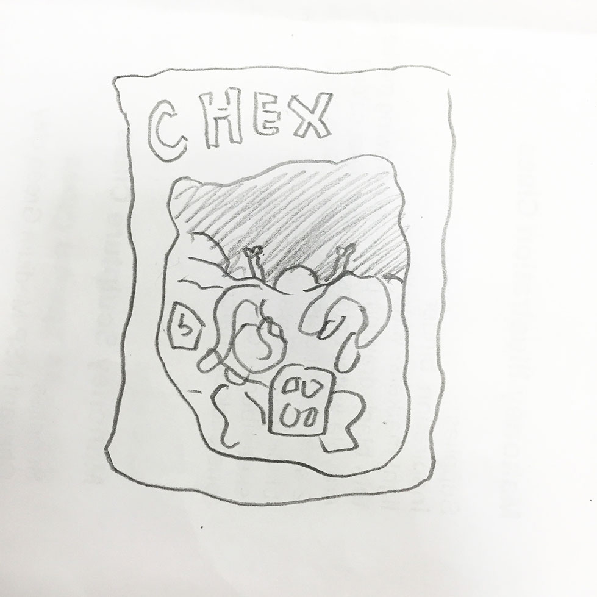
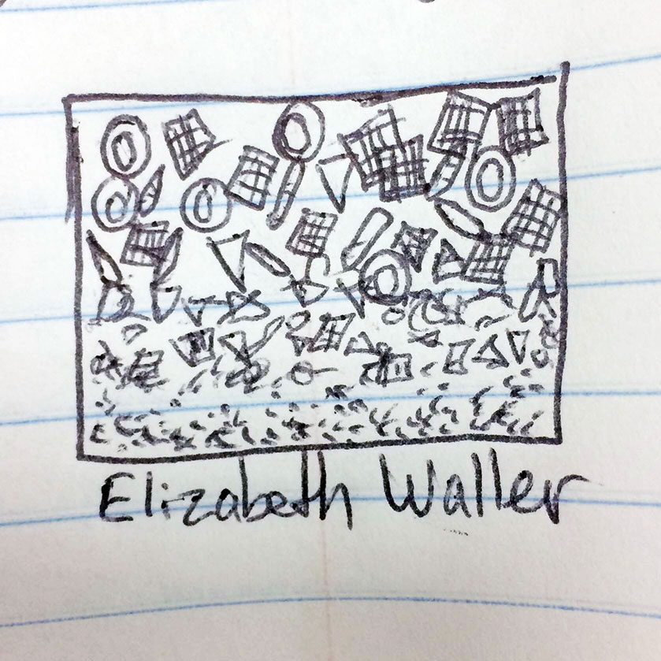
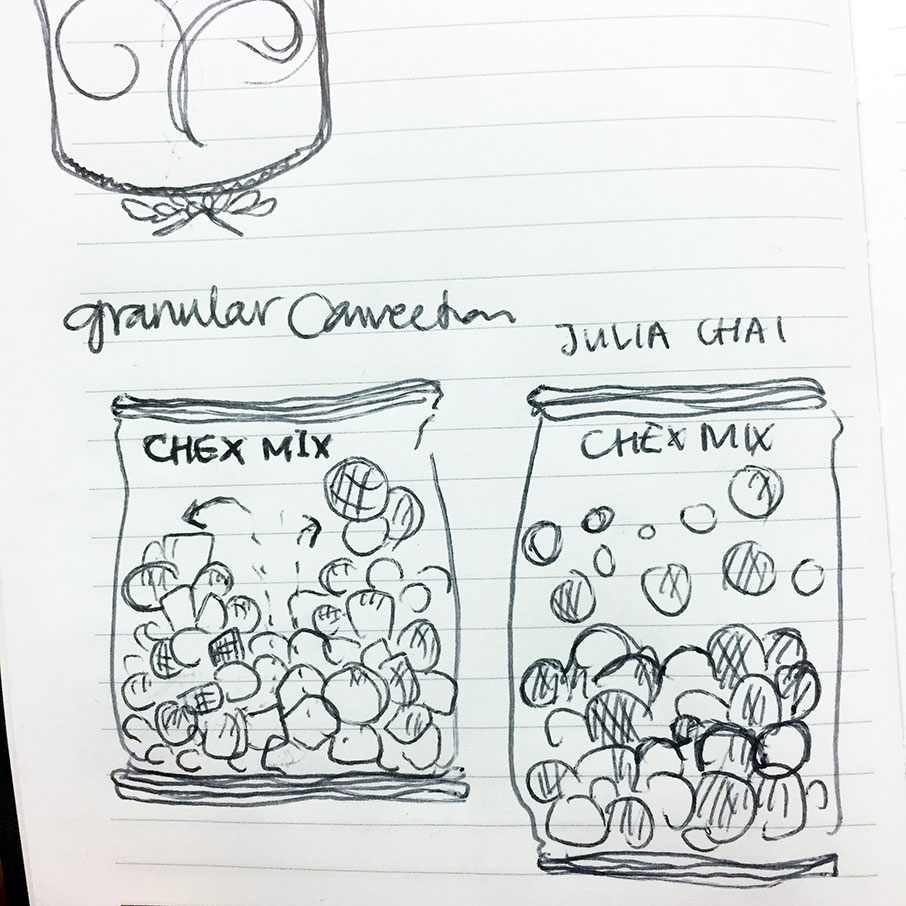

# GLITTERS | AGGREGATES LAB: granular convection in mixed aggregates

> In the average can of mixed nuts, you might find almonds from Italy, walnuts from China, Brazil nuts from Bolivia, cashews from India, pistachios from Turkey, hazelnuts from Canada."
> [https://en.wikipedia.org/wiki/Mixed_nuts]

this 15oz can of mixed nuts has just travelled from New Jersey to your local market.

## predictions

start by drawing what you think the nuts are distributed on the inside.

now open the can and describe what you find.

## experiment

1. put some chips in a bowl. Make sure that there are some broken chips are included in the mix.
2. shake the bowl and watch how the pieces sort themselves out. is this what you expected?

Repeat the experiment with Trail Mix and Muesli.

Repeat the experiment with pea gravel and (heavier) river stones. what comes out on top?

## theory

Why do the larger bits, like Brazil nuts, always find their way to the top of the packet when you shake it?

Existing theory suggests vibrations cause both big and small items to rise together, but that the big nuts or pieces of fruit get stranded on top as the smaller pieces go on mixing.

Granular convection is when small, solid, different-shaped bits of similar mass exhibit circulation patterns similar to fluid convection.

It is counterintuitive to find that the largest and (presumably) heaviest particles rise to the top, but several explanations are possible:

1. The center of mass of the whole system (containing the mixed nuts) in an arbitrary state is not optimally low; it has the tendency to be higher due to there being more empty space around the larger Brazil nuts than around smaller nuts.[citation needed] When the nuts are shaken, the system has the tendency to move to a lower energy state, which means moving the center of mass down by moving the smaller nuts down and thereby the Brazil nuts up.
2. Including the effects of air in spaces between particles, larger particles may become buoyant or sink. Smaller particles can fall into the spaces underneath a larger particle after each shake. Over time, the larger particle rises in the mixture. (According to Heinrich Jaeger, "[this] explanation for size separation might work in situations in which there is no granular convection, for example for containers with completely frictionless side walls or deep below the surface of tall containers (where convection is strongly suppressed). On the other hand, when friction with the side walls or other mechanisms set up a convection roll pattern inside the vibrated container, we found that the convective motion immediately takes over as the dominant mechanism for size separation."[5])
3. The same explanation without buoyancy or center of mass arguments: As a larger particle moves upward, any motion of smaller particles into the spaces underneath blocks the larger particle from settling back in its previous position. Repetitive motion results in more smaller particles slipping beneath larger particles. A greater density of the larger particles has no effect on this process. Shaking is not necessary; any process which raises particles and then lets them settle would have this effect. The process of raising the particles imparts potential energy into the system. The result of all the particles settling in a different order may be an increase in the potential energy—a raising of the center of mass.
4. When shaken, the particles move in vibration-induced convection flow; individual particles move up through the middle, across the surface, and down the sides. If a large particle is involved, it will be moved up to the top by convection flow. Once at the top, the large particle will stay there because the convection currents are too narrow to sweep it down along the wall.

Sidney Nagel and his colleagues at the University of Chicago
