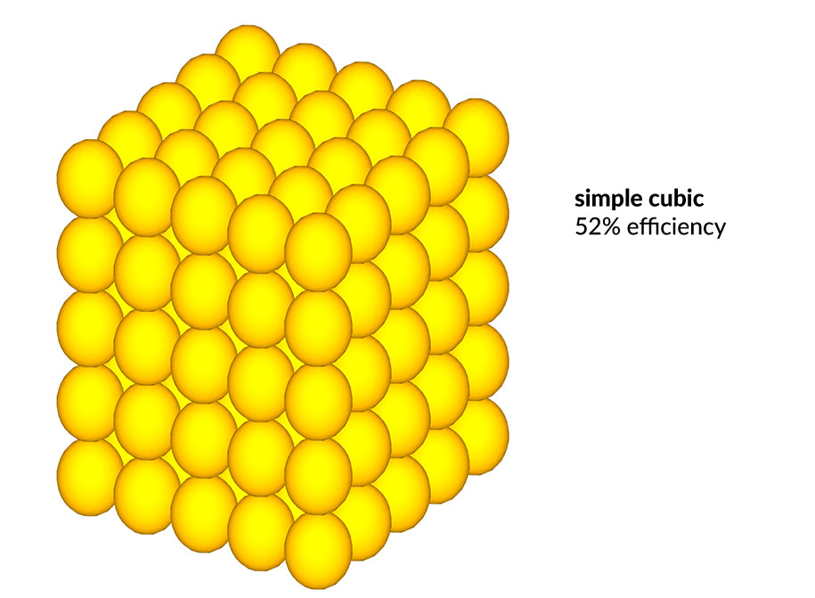

# GLITTERS | An Investigation: further research on efficient packing

After last week's presentation I thought more about stacking spheres in different configurations. The solution you suggested doesn't work on a squared pyramid base. But it would work on a different shape. What if you started with a triangle? That would allow you to stagger the spheres as you suggested and we could make a very efficient three-sided pyramid. On further investigation I learned that thius problem has a rish history. It has been debated for the last 400 years and an adequate proof has been elusive. 

Experiment shows that dropping the spheres in randomly will achieve a density of around 65%. Higher densities may be achieved by arranging the spheres in patterns. 

Simple cubic	52%	6
BCC (Body-Centered Cubic)	68%	8
HCP (Hexagonal Close Packed)	74%	12
CCP (cubic close packed same as FCC)	74%	12

## RANDOM

Efficiency of sphere packing is ~65%. Note that random packing is more efficient than simple cubic packing. It has a lower energy state. 

## SIMPLE CUBIC

Efficiency is 52%.

## FACE-CENTERED CUBIC

Efficicy is 74%.

## BODY-CENTERED CUBIC

Here is a typical pile of cannon balls like you might see on *The Pirates of the Carribean*:

This is the four-sided pyramid I showed you earlier. I 

Johannes Kepler worked on the problem in the 17th century. Kepler's conjecture is that no packing of spheres of the same radius in three dimensions has a density greater than the face-centered (hexagonal) cubic packing. This claim was first published by Johannes Kepler in his monograph "The Six-Cornered Snowflake" (1611) – a treatise inspired by his correspondence with Thomas Harriot.

The Kepler conjecture says that no arrangement of equally sized spheres filling space has a greater average density than that of the cubic close packing (face-centered cubic) and hexagonal close packing arrangements. The density of these arrangements is around 74.05%.

Kepler did not have a proof of the conjecture, and the next step was taken by Carl Friedrich Gauss (1831), who proved that the Kepler conjecture is true if the spheres have to be arranged in a regular lattice. 

After Gauss, no further progress was made towards proving the Kepler conjecture in the nineteenth century. In 1900 David Hilbert included it in his list of twenty-three unsolved problems of mathematics. It forms part of Hilbert's eighteenth problem.

in 1969, Hungarian mathematician László Fejes Tóth thought he’d figured out one simple method: If each sphere is in contact with as many others as possible, the packing would be the densest achievable. But he couldn’t prove it.

Tóth started with what mathematicians call the “kissing number.” Imagine placing a penny on a table and putting as many pennies as you can touching it — or, in mathematical parlance, “kissing” it. You’ll find that exactly six pennies fit, forming a hexagonal pattern. As a result, the kissing number in two dimensions is six. This pattern can be extended to cover the entire table, with each penny surrounded by six others.

Now do the same thing in three dimensions: Take an orange and arrange as many oranges as possible kissing it. It turns out that you can’t fit more than 12, so the kissing number in three dimensions is 12. Unlike with pennies, though, the 12 oranges won’t fit snugly around the central one; there’s a bit of room to spare, so the oranges can jiggle into different positions. As a result, if you extend this pattern out to fill space, with each ball surrounded by 12 others, the jiggliness will give you a lot of choices about how to arrange the balls.

Grocers stack fruit by laying the bottom row of the bottom layer first. They then put the next row in the crevices between the oranges of the first row, the following row in the crevices of the second row, and so on. This process ends up creating a hexagonal pattern, with each orange touching six others in its layer. 

In 1999, Thomas Hales of the University of Michigan announced a proof of the Hexagonal Honeycomb Conjecture, which says that regular hexagons as in Figure 1 provide the least-perimeter way to enclose infinitely many unit areas in the plane. Although widely believed and often asserted as fact, this conjecture eluded proof until 1999. 

Questions remained until 2003 when Hales started the Flyspeck project: an effort to vindicate his proof through formal verification. His team used two formal proof software assistants called Isabelle and HOL Light, both of which are built on a small kernel of logic that has been intensely scrutinised for any errors – this provides a foundation which ensures the computer can check any series of logical statements to confirm they are true.

“It has been a huge effort,” says Alan Bundy of the University of Edinburgh, UK, who was not involved in the work. He adds that he hopes Flyspeck’s success will inspire other mathematicians to start using proof assistants. 