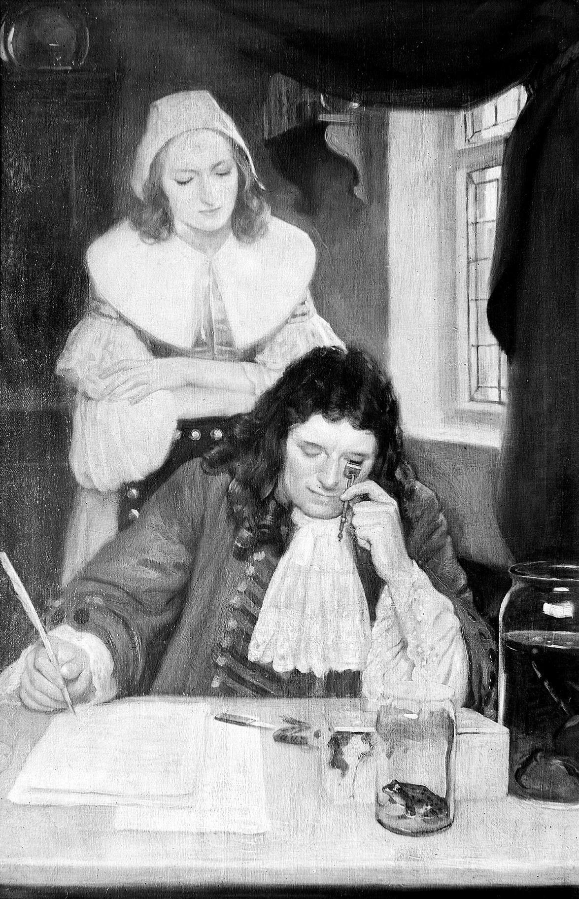

# Glitters | PNNL Smartphone Microscope

> clips and glass beads ordered september 17. we will build the microscopes and recreate Hooke's observations of cork cells.

Combine your iPhone or tablet with a 3D-printed clip and glass sphere to create an inexpensive and powerful microscope. 

The microscope slips over the camera lens of the cell phone and is no thicker than a phone case. It’s designed to fit most cell phone brands, including iPhone 4 and 5, Galaxy S3 and S4 phones and iPads. The material cost, not including the printer, is under $1.

The PNNL team has made a 350x version, which is adequate to identify parasites in blood samples or protozoa in drinking water. A 100x version enables children to investigate common items like salt grains and flower petals in much greater detail.

Using glass spheres as a microscope lens is not a new idea, optically, but the small size of the housing combined with very high magnification and extremely low cost is what makes this device practical.

Low cost was a driver in the research and development project targeting a specific Department of Homeland Security need for rapid bio detection technologies. The microscope needed to be so cheap it could literally be thrown away – in case it gets contaminated.

"We feel there are many uses out there including human and veterinary medicine in developing countries," said Janine Hutchison a microbiologist at PNNL. "We are also really excited about engaging kids in science. School districts have a hard time providing enough microscopes for students. Our science education staff is getting it into the hands of local school children this fall through the auspices of the Mid-Columbia STEM Education Collaboratory."

## Troubleshooting Tips
Start with the 100x version if possible.  Learning and getting familiar with the system using the lowest magnification possible will increase the usefulness with the higher magnification versions.  The higher magnification versions are more sensitive to alignment and take more time and practice to produce good images.

The lens must be pushed into the plastic housing until the front of the lens is flush with the housing.   If the camera is having trouble focusing on an object, double check the lens placement to make sure the lens is fully seated in the plastic. 

If the image has blurry or dark spots that never change no matter what you are imaging, it could be from a dirty lens or defects in the lens. Try to clean the lens using water or rubbing alcohol and a soft cloth or tissue.  If this doesn’t help, and if the image is degraded too much due to these defects, pop out the lens and replace it with a new one.

## Lens Specifications

The bead sizes below correspond to the 3D printer files for each magnification.  Each printer will have a unique level of shrinkage that will slightly impact the hole diameter where the bead sits.  Printing a few prototypes on your printer, or increasing the hole size carefully with a small drill bit or needle after the fact can help adjust for the shrinkage if the hole was printed too small.

 - The 100x version requires a bead with a 3mm diameter
 - All 350x versions require a bead with approximately 1mm diameter

Please note the inexpensive beads come in a variety of qualities.  Bubbles, defects, and slightly misshapen spheres are all expected within the bead selection. Do your best to choose a bead that appears as round as possible and also as clear as possible.