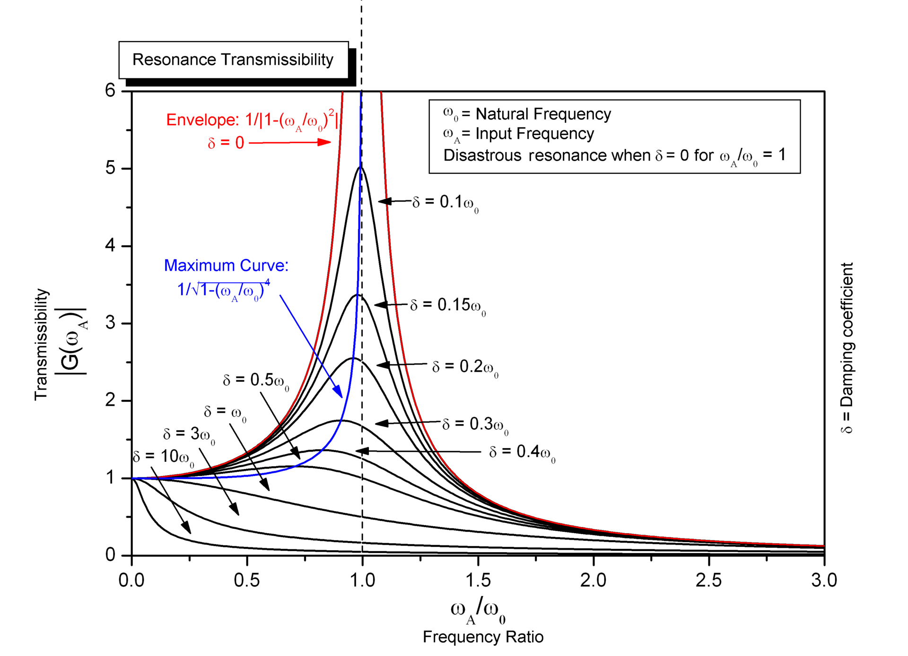

# GLITTERS: RESONANCE LECTURE

1. Temperature of water with ice cubes in water demo
2. Brownian Motion demo
3. question: how might masses of molecules inform resonance?
4. question: what's holding the water together?
5. resonance

> resonance is a phenomenon in which a vibrating system or external force drives another system to oscillate with greater amplitude at a specific preferential frequency. [^1]

[^1]: [wikipedia](https://en.wikipedia.org/wiki/Resonance)

**questions**

1. What happens when a material resonates? 
2. How do you find the resonance of a material?
3. How does crystal packing inform resonance?
4. Do all materials have a resonance point?
5. Why do some materials resonate better (or longer) than others?
6. Can you talk about the resonance we see in archival films on the Tacoma Narrows bridge failure?
7. It was recently discovered that conversations vibrate thin films like the ones used in potato chip bags. How would you listen in on these conversations?
8. Can you describe the different kinds of waves produced by an earthquake?
9. Some (earthquakes) waves are more destructive then others. Can you demonstrate why?
10. Where does a cat's purr come from?

# lecture

All things resonate and everything has natural frequency of vibration, aka its **resonant frequency**. Many sounds we hear are caused by resonant vibrations in the object. Examples:

1. Timekeeping mechanisms of modern clocks and watches, e.g., the balance wheel in a mechanical watch and the quartz crystal in a quartz watch
2. pendulums and swings
2. Acoustic resonances of musical instruments including the human vocal tract
3. attering of a crystal wineglass when exposed to a musical tone of the right pitch (its resonant frequency)
4. resonance of columns of air in flutes, clarinets and pipe organs

Demo

Debate