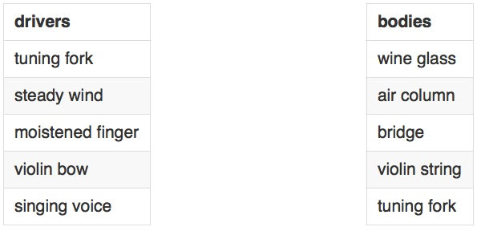
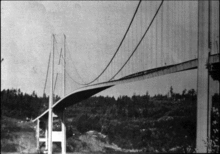

# GLITTERS: DEMO | find the natural resonant frequency of several objects

1. drinking glasses with a damp finger (~glass organ)
2. a kid on a swing (or a bob on a pendulum)
3. tuning forks with a violin bow
4. singing to a wine glass
5. a column of air

Compare the resonance examples to blowing through a blade of grass held between your thumbs. Compare to a flute. 

Let's talk about the flute. What is driving the oscillations in the air? How does it compare to the PVC experiment we saw earlier?

Separate the drivers from the oscillator and make connections.

The reading gives The [Tacoma Narrows Bridge collapse](imgs/TacomaNarrowsBridgeCollapse.mp4) as the ultimate example of the destructive power of driven oscillations. Let's talk about it. 

The original Tacoma Narrows Bridge roadway twisted and vibrated violently under 40-mile-per-hour (64 km/h) winds on the day of the collapse
