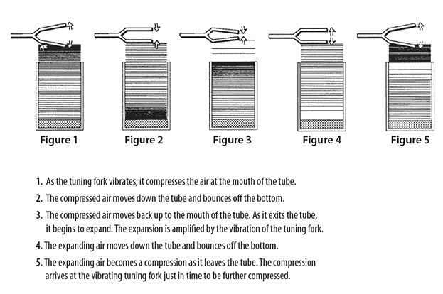

# resonanating an organ pipe

You can amplify a tuning fork by holding it over a pipe and changing the length of the pipe. At certain pipe lengths, the pitch made by the tuning fork sounds very loud as it resonates with the air column in the pipe.

**materials**

1. A large graduated cylinder (approximately 1-liter capacity) or other clear, deep cylinder that can hold water.
2. A 3-foot (1-meter) length of clear or opaque plastic pipe, approximately 2 inches (5 centimeters) in diameter
3. Tuning fork(s)
4. water

## To Do and Notice
Strike a tuning fork and hold it so that its tines, vibrating in a vertical plane, are above and very near the end of the pipe (click to enlarge the diagram below). 

While you hold the vibrating fork just above the end of the pipe, slide the pipe up and down in the cylinder until you find a place where the sound is louder.

As the fork continues to vibrate (strike it again as needed), move the pipe upward to find other loud spots. Repeat the procedure with tuning forks of different frequencies and compare results.

## compare

Tones created by rubbing a finger along the top of a wine glass. How does the level of the water change the frequency of the tone?