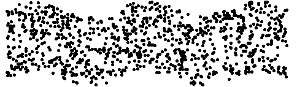
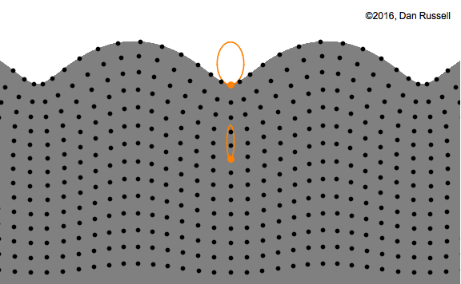
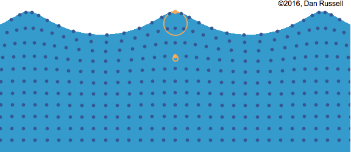

# waves

## body waves

Body waves travel through the interior of the earth and arrive before the surface waves emitted by an earthquake. These waves are of a higher frequency than surface waves.

### primary (P) waves

This is the fastest kind of seismic wave, and, consequently, the first to arrive. The P wave can move through solid rock and fluids, like water or the liquid layers of the earth. It pushes and pulls the rock it moves through just like sound waves push and pull the air. Typical values for P-wave velocity in earthquakes are in the range 5-8 km/s (11,185-17,895 mph).

In a longitudinal wave the particle displacement is parallel to the direction of wave propagation.

[Longitudinal Waves on a Slinky](imgs/Longitudinal Waves on a Slinky.mp4)

### secondary (S) waves

This is the second wave you feel in an earthquake. An S wave is slower than a P wave and can only move through solid rock, not through any liquid medium. S waves move rock particles up and down, or side-to-side--perpindicular to the direction that the wave is traveling in (the direction of wave propagation). 

In a transverse wave the particle displacement is perpendicular to the direction of wave propagation. 

## surface waves

The Love wave [^1] . It's the fastest surface wave and moves the ground from side-to-side. 

[^1]: named after A.E.H. Love, a British mathematician who worked out the mathematical model for this kind of wave in 1911.

 [^2]

[^2]: named for John W. Strutt, 3rd Baron Rayleigh who first studied them in 1885). The particles in a solid, through which a Rayleigh surface wave passes, move in elliptical paths, with the major axis of the ellipse perpendicular to the surface of the solid. As the depth into the solid increases the "width" of the elliptical path decreases.

Rayleigh waves in an elastic solid are different from surface waves in water in a very important way. In a water wave all particles travel in clockwise circles. However, in a Rayleigh surface wave, particles at the surface trace out a counter-clockwise ellipse, while particles at a depth of more than 1/5th of a wavelength trace out clockwise ellispes. This motion is often referred to as being "retrograde" since at the surface, the horizontal component of the particle motion is in the opposite direction as the wave propagation direction. I have identified two particles in orange in this animation to illustrate the retrograde elliptical path at the surface and the reversal in the direction of motion as a function of depth.

These are the waves that cause the most damage during an earthquake. They travel with velocities slower than S waves, and arrive later, but with much greater amplitudes. 

Water waves are an example of waves that involve a combination of both longitudinal and transverse motions. As a wave travels through the waver, the particles travel in clockwise circles.

---

See [Acoustics and Vibration Animations](http://www.acs.psu.edu/drussell/Demos/waves/wavemotion.html) for more.

## Earthquakes

The speed of seismic waves varies according to the region of the Earth's interior, from less than 6 km

### Wave velocity in common rock types

| Rocktype	| Velocity [m/s]	| Velocity [mp/h] |
|----		|----			|----			|
| Unconsolidated Sandstone	| 4600 - 5200	| 10290 - 11632 |
| Consolidated Sandstone	| 5800	| 12974 |
| Shale		| 1800 - 4900	| 4026 -10961 |
| Limestone	| 5800 - 6400	| 12974 - 14316 |
| Dolomite	| 6400 - 7300	| 14316 - 16330 |
| Anhydrite	| 6100			| 13645 |
| Granite	| 5800 - 6100	| 12974 - 13645 |
| Gabbro	| 7200			| 16106 |

rule of thumb: the number of seconds between the P and S wave times 5 is approximately the distance in miles to the earthquake.

Imagine a Slinky, held between two people. Pushing it sideways sends a wave down the Slinky*. Each piece of the Slinky moves back and forth sideways (this is the particle motion) while the wave travels the length of the Slinky (this is the wave direction.) As the wave passes through, the Slinky does not change its size, only its shape. If you let go of the top, it will return to its original, cylindrical shape, demonstrating the Slinky's resistance to shear. When one section of Slinky is sheared, its resistance transfers that deformation to the neighboring section, and a wave results. 

Only a material that resists shear can transmit an S-wave. Thus shear waves are only seen in solids and cannot transmit through a liquid or a gas. The lack of S-waves through the outer core was one of the clues that showed Inge Lehmann that the outer core must be a liquid.[^3]

[^3]: [A Parent's Guide to Earthquakes](https://earthquake.usgs.gov/learn/kids/abc/parents/pa.html)

